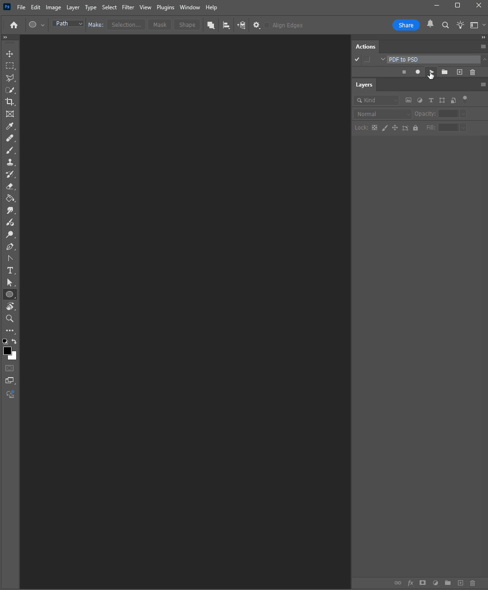

# PDF-to-PSD Stack Import

Импортирует все страницы PDF в один PSD-документ.
Каждая страница PDF становится отдельным слоем.

---

🌍 Language: [English](readme.md) | [Русский](readme.ru.md)

## Demo

**PDF → Полностью слоёный PSD за секунды**

- Выбор цветового режима и разрешения
- Настройка порядка страниц
- Автоматическое выравнивание холста
- Каждая страница помещается на отдельный слой

## Возможности

- Поддержка RGB, CMYK и Grayscale
- Пользовательское значение DPI
- Опциональный инвертированный порядок страниц
- Прогресс-бар (можно отключить)
- Тихий режим для автоматизации
- Автоматическая подстройка размера документа по самой большой странице

---

## Установка

1. Скачайте файл .jsx
2. Скопируйте его в папку:

   Windows:
   C:\Program Files\Adobe\Adobe Photoshop <version>\Presets\Scripts\

   Mac:
   Applications/Adobe Photoshop <version>/Presets/Scripts/

3. Перезапустите Photoshop
4. Запустите скрипт через:
   File → Scripts → PDF-to-PSD Stack Import

---

## Использование

1.	Выберите PDF-файл
2.	Укажите DPI и цветовой режим
3.	Выберите порядок страниц
4.	Включите или отключите тихий режим
5.	Нажмите OK

---

## Version History

### 1.0.0
-	Первая стабильная версия
-	Добавлен прогресс-бар
-	Добавлен тихий режим
-	Добавлен инвертированный порядок страниц
-	Исправлена обработка размера холста при страницах разного формата

---

## License

MIT License

